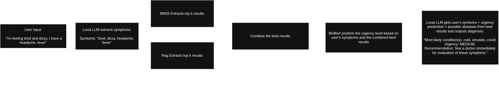

# Medical Triage Assistant
We present an application called medical triage assistant which was created to determine the patient’s most likely medical condition, its urgency level, and suggest the next steps based on the patient’s text description of their symptoms. We created a pipeline that utilizes local LLMs to extract the patient’s symptoms from their input, combines Retrieval-Augmented-Generation (RAG) and Best Matching 25 (BM25) to retrieve a relevant context from a large medical corpus, and applies a fine-tuned BioBERT classifier to determine the medical urgency based on three levels LOW, MEDIUM and HIGH. All this information is then further processed and presented in a text format to the patient. **The primary goal for the assistant is to provide an initial assessment of a patient, while addressing the privacy concerns of cloud-based AI medical systems since everything runs locally. The system is intended as a decision-support tool only and does not constitute professional medical advice.** 

## Preview 

(Showcase of the whole pipeline)


https://github.com/user-attachments/assets/ccb38401-0ae1-4430-9f00-fc368ec9a148

(Showcase of the user interaction. Note: The processing time is cut)

## Detailed information about the pipeline can be found in the report TODO:


## Prerequisites
- Ollama (used to manage local LLMs) - Download [here](https://ollama.com/download/)
- Python >= 3.11
- uv - Download [here](https://docs.astral.sh/uv/)

## Setup

### 1. Clone the project

### 2. Download neccessary files for RAG, BM25 and BERT from Huggingface
Copy the contents of the `RAG`, `BM25`, `models` and `dataset` folders from the [link](https://huggingface.co/ondralol/nlp_project/tree/main) to your local project folder. Keep the same structure - meaning that the content of `RAG` folder from HuggingFace needs to go to the local `RAG` folder

Note: for the first run, the programm will download another ~400MB embedding model from HuggingFace, so first load might take while. Other runs should be faster

### 3. Install local LLM
After successfuly installing Ollama, install local LLM models by using
```
ollama pull {model_name}
```
For tested our project primarily with `gemma4:e2b`, `llama3.2:3b `qwen2.5:0.5b`, but you may try with different models but making simple changes

### 4. Download all the dependencies
Before running for the first time download dependecies by using
```
uv sync
```

### 5. Run the application
You can run the application using
```
uv run src/main.py
```


## Running the jupyter notebook
First run
```
uv sync
```
and in order to install kernel run 
```
uv run python -m ipykernel install --user --name=nlp-project --display-name "NLP Project"
```
Finally to open the notebook run
```
uv run jupyter notebook
```
and open the appropriate notebook

Note: if using inside sagemaker, copy the pyproject.toml and do the same steps. Then select the `NLP Project` kernel.


## Project strucure
- In `/notebooks` are notebooks used for dataset exploration preprocessing and model training
- Main application source code is in the `src/` folder
